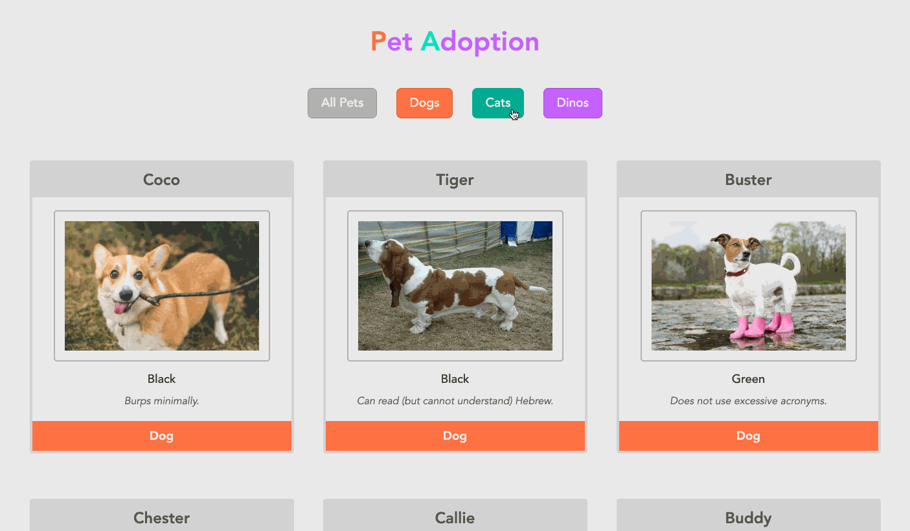

# Pet Adoption

In this project, you will see how there are buttons to filter out the types of pets that display on the screen. Each pet card has a different color depending on the pet's type.

## Preview

## View Project
- Clone the repository 👉🏼 `$ git clone https://github.com/RyanBeiden/pet-adoption.git`

- Run any http server `$ hs` or code editor to view project 👀

## Technologies Used
  
